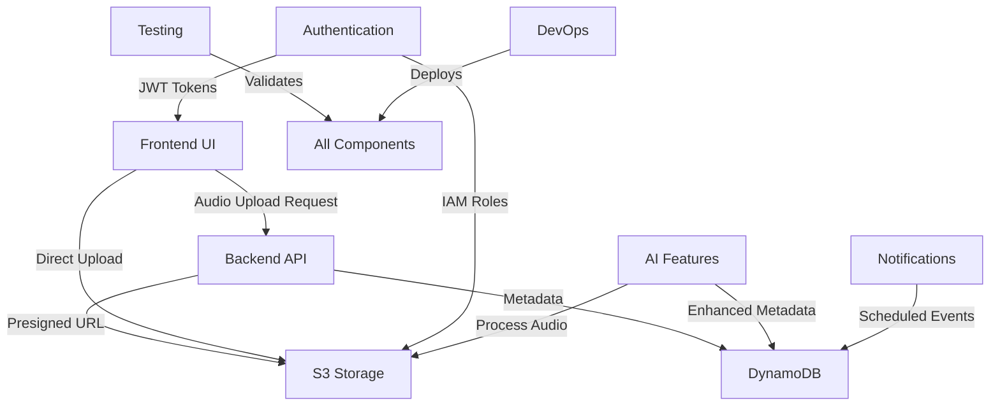

# 🔄 Echoes Integration Coordination Plan

## 🎯 Integration Architecture Overview

This document defines the coordination strategy for seamless integration between all 9 agents working on the Echoes audio time machine web app.

## 📊 Data Flow Architecture



## 🤝 Agent Coordination Protocols

### Phase 1: Foundation (Week 1)
**Priority Order**: Infrastructure → Storage → Authentication

#### Agent-04 (Infrastructure) Deliverables:
```yaml
outputs:
  cognito_user_pool_id: !Ref CognitoUserPool
  cognito_user_pool_client_id: !Ref CognitoUserPoolClient
  cognito_identity_pool_id: !Ref CognitoIdentityPool
  s3_bucket_name: !Ref EchoesBucket
  dynamodb_table_name: !Ref EchoesTable
  api_gateway_url: !Ref ApiGateway
```

#### Agent-03 (Storage) Dependencies:
```json
{
  "required_from_agent_04": [
    "s3_bucket_name",
    "dynamodb_table_name",
    "iam_roles"
  ],
  "deliverables": {
    "dynamodb_schema": "EchoesTable structure",
    "s3_bucket_policy": "Access permissions",
    "data_validation": "Schema validation functions"
  }
}
```

#### Agent-05 (Authentication) Dependencies:
```json
{
  "required_from_agent_04": [
    "cognito_user_pool_id",
    "cognito_user_pool_client_id",
    "cognito_identity_pool_id"
  ],
  "deliverables": {
    "auth_sdk": "Frontend integration library",
    "jwt_validation": "Backend token validation",
    "iam_integration": "S3 access configuration"
  }
}
```

### Phase 2: Core Services (Week 2)
**Priority Order**: API → Frontend → AI Features

#### Agent-02 (Backend API) Integration Points:
```typescript
// API Contract Definition
interface EchoMetadata {
  userId: string;
  echoId: string;
  emotion: string;
  timestamp: string;
  s3Url: string;
  location?: {
    lat: number;
    lng: number;
  };
  tags?: string[];
  transcript?: string;
  detectedMood?: string;
}

// Required Endpoints
POST /echoes/init-upload
POST /echoes
GET /echoes?emotion=joy
GET /echoes/random?emotion=joy

// Dependencies from other agents
- Agent-03: DynamoDB table access
- Agent-04: Lambda function deployment
- Agent-05: JWT token validation
```

#### Agent-01 (Frontend) Integration Points:
```typescript
// Frontend Dependencies
interface FrontendRequirements {
  api_base_url: string;
  cognito_config: CognitoConfig;
  audio_upload_endpoints: string[];
  emotion_categories: string[];
}

// Integration with Agent-02 (API)
const uploadEcho = async (audioBlob: Blob, metadata: EchoMetadata) => {
  const { presignedUrl } = await api.post('/echoes/init-upload');
  await uploadToS3(presignedUrl, audioBlob);
  await api.post('/echoes', metadata);
};

// Integration with Agent-05 (Auth)
const authenticationFlow = {
  login: () => Auth.signIn(username, password),
  register: () => Auth.signUp(email, password),
  getToken: () => Auth.currentSession()
};
```

#### Agent-06 (AI Features) Integration Points:
```python
# AI Service Integration
class EchoAIProcessor:
    def __init__(self, bedrock_client, s3_client, dynamodb_client):
        self.bedrock = bedrock_client
        self.s3 = s3_client
        self.dynamodb = dynamodb_client
    
    async def process_echo(self, echo_id: str, s3_url: str):
        # Download audio from S3
        audio_data = await self.s3.get_object(s3_url)
        
        # Transcribe audio
        transcript = await self.transcribe_audio(audio_data)
        
        # Detect emotion
        detected_mood = await self.analyze_emotion(transcript, audio_data)
        
        # Update DynamoDB with enriched metadata
        await self.update_echo_metadata(echo_id, transcript, detected_mood)

# Dependencies
- Agent-03: S3 and DynamoDB access
- Agent-02: API integration for processing triggers
```

### Phase 3: Enhancement Services (Week 3)
**Priority Order**: Notifications → Testing → DevOps

#### Agent-07 (Notifications) Integration:
```typescript
// Notification Service
interface NotificationConfig {
  echo_id: string;
  user_id: string;
  notification_time: string;
  emotion_context: string;
}

// EventBridge Integration
const scheduleEchoReminder = async (config: NotificationConfig) => {
  await eventBridge.putEvents({
    Entries: [{
      Source: 'echoes.app',
      DetailType: 'Echo Reminder',
      Detail: JSON.stringify(config),
      Time: new Date(config.notification_time)
    }]
  });
};

// Dependencies
- Agent-04: EventBridge and SNS setup
- Agent-02: API integration for scheduling
- Agent-03: DynamoDB for notification tracking
```

## 🔗 API Contract Definitions

### Authentication Endpoints
```yaml
/auth/login:
  method: POST
  body: { email: string, password: string }
  response: { token: string, user: UserProfile }

/auth/register:
  method: POST
  body: { email: string, password: string, name: string }
  response: { user: UserProfile }

/auth/refresh:
  method: POST
  headers: { Authorization: "Bearer <token>" }
  response: { token: string }
```

### Echo Management Endpoints
```yaml
/echoes/init-upload:
  method: POST
  headers: { Authorization: "Bearer <token>" }
  body: { emotion: string, duration: number }
  response: { presignedUrl: string, echoId: string }

/echoes:
  method: POST
  headers: { Authorization: "Bearer <token>" }
  body: EchoMetadata
  response: { success: boolean, echoId: string }

/echoes:
  method: GET
  headers: { Authorization: "Bearer <token>" }
  query: { emotion?: string, limit?: number, offset?: number }
  response: { echoes: EchoMetadata[], total: number }

/echoes/random:
  method: GET
  headers: { Authorization: "Bearer <token>" }
  query: { emotion?: string }
  response: { echo: EchoMetadata }
```

### AI Enhancement Endpoints
```yaml
/echoes/{echoId}/transcribe:
  method: POST
  headers: { Authorization: "Bearer <token>" }
  response: { transcript: string }

/echoes/{echoId}/analyze:
  method: POST
  headers: { Authorization: "Bearer <token>" }
  response: { detectedMood: string, tags: string[] }
```

## 🗄️ Data Schema Standardization

### DynamoDB EchoesTable Schema
```json
{
  "TableName": "EchoesTable",
  "KeySchema": [
    { "AttributeName": "userId", "KeyType": "HASH" },
    { "AttributeName": "timestamp", "KeyType": "RANGE" }
  ],
  "AttributeDefinitions": [
    { "AttributeName": "userId", "AttributeType": "S" },
    { "AttributeName": "timestamp", "AttributeType": "S" },
    { "AttributeName": "emotion", "AttributeType": "S" }
  ],
  "GlobalSecondaryIndexes": [
    {
      "IndexName": "emotion-timestamp-index",
      "KeySchema": [
        { "AttributeName": "emotion", "KeyType": "HASH" },
        { "AttributeName": "timestamp", "KeyType": "RANGE" }
      ]
    }
  ]
}
```

### S3 Bucket Structure
```
echoes-audio-{environment}/
├── {userId}/
│   ├── {echoId}.webm (audio file)
│   ├── {echoId}_metadata.json (optional backup)
│   └── thumbnails/
│       └── {echoId}.png (generated thumbnail)
```

### Emotion Categories Standardization
```typescript
export const EMOTION_CATEGORIES = [
  'Joy', 'Sadness', 'Anger', 'Fear', 'Surprise', 'Disgust',
  'Calm', 'Excited', 'Nostalgic', 'Peaceful', 'Anxious', 'Content'
] as const;

export type Emotion = typeof EMOTION_CATEGORIES[number];
```

## 🔄 Integration Testing Strategy

### Component Integration Tests
```typescript
// Agent-01 & Agent-02 Integration
describe('Frontend-API Integration', () => {
  test('Upload echo flow', async () => {
    const mockAudio = new Blob(['mock audio'], { type: 'audio/webm' });
    const metadata = { emotion: 'Joy', location: { lat: 37.5, lng: -77.4 } };
    
    const result = await uploadEcho(mockAudio, metadata);
    expect(result.success).toBe(true);
  });
});

// Agent-02 & Agent-03 Integration
describe('API-Storage Integration', () => {
  test('Save echo metadata', async () => {
    const metadata = createMockEchoMetadata();
    const result = await saveEchoMetadata(metadata);
    expect(result.echoId).toBeDefined();
  });
});
```

### End-to-End Integration Tests
```typescript
describe('Complete Echo Workflow', () => {
  test('Record → Upload → Store → Retrieve', async () => {
    // 1. Frontend records audio
    const audioBlob = await recordAudio(10000); // 10 seconds
    
    // 2. Upload to S3 via API
    const uploadResult = await uploadEcho(audioBlob, {
      emotion: 'Calm',
      location: { lat: 37.5, lng: -77.4 }
    });
    
    // 3. Verify storage
    const storedEcho = await getEcho(uploadResult.echoId);
    expect(storedEcho.emotion).toBe('Calm');
    
    // 4. Test retrieval
    const randomEcho = await getRandomEcho('Calm');
    expect(randomEcho).toBeDefined();
  });
});
```

## 🚦 Conflict Resolution Protocols

### Schema Conflicts
**Protocol**: All schema changes must be approved by Agent-03 (Storage) and validated by Agent-08 (Testing)

### API Changes
**Protocol**: API modifications require approval from Agent-02 (Backend) and testing by Agent-01 (Frontend)

### Infrastructure Changes
**Protocol**: All infrastructure modifications must be reviewed by Agent-04 and deployed by Agent-09

### Authentication Changes
**Protocol**: Security changes require approval from Agent-05 and security testing by Agent-08

## 📋 Integration Milestones & Checkpoints

### Week 1 Checkpoint
- [ ] Infrastructure deployed and accessible
- [ ] DynamoDB table created with correct schema
- [ ] S3 bucket configured with proper permissions
- [ ] Cognito user pool functional
- [ ] Authentication flow tested

### Week 2 Checkpoint
- [ ] API endpoints functional and documented
- [ ] Frontend can authenticate users
- [ ] Audio upload flow complete
- [ ] Metadata storage working
- [ ] Basic echo retrieval functional

### Week 3 Checkpoint
- [ ] AI features processing audio
- [ ] Notifications system functional
- [ ] All integration tests passing
- [ ] Performance benchmarks met
- [ ] Security audit complete

### Week 4 Checkpoint
- [ ] Production deployment successful
- [ ] Monitoring and alerting active
- [ ] Load testing passed
- [ ] User acceptance testing complete
- [ ] Documentation finalized

## 🔧 Development Environment Coordination

### Shared Environment Variables
```bash
# Agent-04 provides
export AWS_REGION=us-east-1
export COGNITO_USER_POOL_ID=${USER_POOL_ID}
export DYNAMODB_TABLE_NAME=EchoesTable
export S3_BUCKET_NAME=echoes-audio-dev

# Agent-02 provides
export API_BASE_URL=https://api.dev.echoes.app

# Agent-05 provides
export COGNITO_APP_CLIENT_ID=${APP_CLIENT_ID}
```

### Docker Compose for Local Development
```yaml
version: '3.8'
services:
  localstack:
    image: localstack/localstack
    environment:
      - SERVICES=s3,dynamodb,cognito-idp,lambda,apigateway
    ports:
      - "4566:4566"
  
  frontend:
    build: ./frontend
    ports:
      - "3000:3000"
    depends_on:
      - localstack
  
  backend:
    build: ./backend
    ports:
      - "8000:8000"
    depends_on:
      - localstack
```

## 📞 Communication Protocols

### Daily Integration Sync
- **Time**: 9:00 AM daily
- **Duration**: 15 minutes
- **Attendees**: All 9 agents + Project Coordinator
- **Format**: Blockers, dependencies, integration status

### Weekly Architecture Review
- **Time**: Friday 2:00 PM
- **Duration**: 60 minutes
- **Focus**: Cross-component integration, performance, security

### Emergency Escalation
- **Trigger**: Integration failure, security issue, deployment blocker
- **Response Time**: < 2 hours
- **Protocol**: Immediate Slack notification + video call

---

**Document Owner**: Project Coordinator  
**Last Updated**: 2025-06-28  
**Next Review**: Daily during development phase