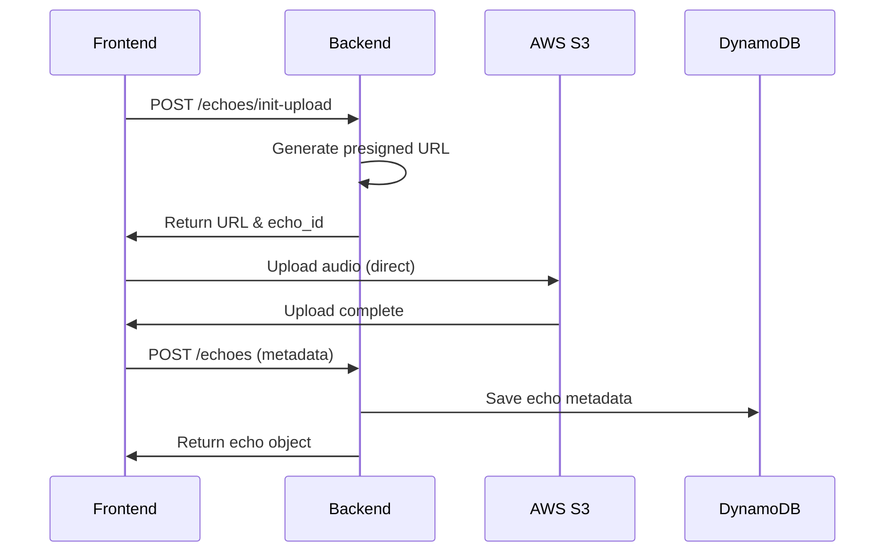

# API Integration Guide

This guide documents the integration between the Echoes frontend and backend APIs.

## Table of Contents
- [Overview](#overview)
- [Configuration](#configuration)
- [Authentication](#authentication)
- [API Endpoints](#api-endpoints)
- [Error Handling](#error-handling)
- [Development Setup](#development-setup)
- [Testing](#testing)

## Overview

The Echoes application uses a FastAPI backend with a React/TypeScript frontend. Communication happens through REST APIs with JWT authentication provided by AWS Cognito.

### Architecture
```
Frontend (React + Vite) ←→ API Client ←→ Backend (FastAPI) ←→ AWS Services
                                                          ├→ S3 (Audio Storage)
                                                          ├→ DynamoDB (Metadata)
                                                          └→ Cognito (Auth)
```

## Configuration

### Environment Variables

Create a `.env` file in the frontend directory based on `.env.example`:

```bash
# API Configuration
VITE_API_URL=http://localhost:8000
VITE_API_PREFIX=/api/v1

# AWS Cognito Configuration
VITE_COGNITO_USER_POOL_ID=your-pool-id
VITE_COGNITO_CLIENT_ID=your-client-id
VITE_COGNITO_REGION=us-east-1

# S3 Configuration
VITE_S3_BUCKET_NAME=echoes-audio-dev
VITE_AWS_REGION=us-east-1
```

### CORS Configuration

The backend is configured to accept requests from:
- `http://localhost:3000` (development)
- `http://localhost:8080` (alternative port)

Vite proxy is configured to forward `/api` and `/health` endpoints to the backend.

## Authentication

### JWT Token Flow

1. **Login/Register**: User credentials → Cognito → JWT tokens
2. **API Requests**: Frontend attaches JWT token as `Authorization: Bearer <token>`
3. **Token Refresh**: Automatic refresh before expiration (1-hour lifetime)

### Implementation

```typescript
// Login
const cognitoUser = await authService.login({ email, password });

// Token is automatically attached to all API requests
const response = await apiService.getEchoes();
```

## API Endpoints

### Health Check
```
GET /health
Response: {
  "status": "healthy",
  "service": "echoes-api",
  "version": "1.0.0",
  "environment": "development"
}
```

### Echo Management

#### Initialize Upload
```
POST /api/v1/echoes/init-upload
Headers: Authorization: Bearer <token>
Body: {
  "content_type": "audio/webm",
  "file_size": 1024000,
  "emotion": "happy",
  "tags": ["morning", "coffee"],
  "location": "Home"
}
Response: {
  "upload_url": "https://s3.amazonaws.com/...",
  "fields": { ... },
  "s3_key": "user123/echo456.webm",
  "echo_id": "echo456"
}
```

#### Create Echo Metadata
```
POST /api/v1/echoes?echo_id=echo456
Headers: Authorization: Bearer <token>
Body: {
  "file_extension": "webm",
  "emotion": "happy",
  "tags": ["morning"],
  "transcript": "",
  "duration_seconds": 30
}
Response: {
  "echo_id": "echo456",
  "emotion": "happy",
  "timestamp": "2024-01-01T12:00:00Z",
  "s3_url": "s3://bucket/key",
  ...
}
```

#### List Echoes
```
GET /api/v1/echoes?page=1&page_size=20&emotion=happy
Headers: Authorization: Bearer <token>
Response: {
  "echoes": [...],
  "total_count": 50,
  "page": 1,
  "page_size": 20,
  "has_more": true
}
```

#### Get Random Echo
```
GET /api/v1/echoes/random?emotion=nostalgic
Headers: Authorization: Bearer <token>
Response: Echo object
```

#### Get Specific Echo
```
GET /api/v1/echoes/{echo_id}
Headers: Authorization: Bearer <token>
Response: Echo object
```

#### Delete Echo
```
DELETE /api/v1/echoes/{echo_id}
Headers: Authorization: Bearer <token>
Response: 204 No Content
```

## Error Handling

### Error Response Format
```json
{
  "detail": "Error message",
  "status_code": 400
}
```

### Common Error Codes
- `401`: Unauthorized - Invalid or expired token
- `403`: Forbidden - Access denied
- `404`: Not Found - Resource doesn't exist
- `422`: Validation Error - Invalid request data
- `500`: Internal Server Error

### Frontend Error Handling

The API client includes automatic retry logic for 401 errors:
1. Attempt to refresh the token
2. Retry the original request
3. If refresh fails, redirect to login

## Development Setup

### Starting the Services

1. **Backend**:
   ```bash
   cd backend
   python -m uvicorn app.main:app --reload --port 8000
   ```

2. **Frontend**:
   ```bash
   cd frontend
   npm install
   npm run dev
   ```

### API Client Usage

```typescript
import { apiService } from './services/apiService';

// Upload audio with progress tracking
const result = await apiService.uploadAudioWithProgress(
  audioBlob,
  {
    emotion: 'happy',
    tags: ['morning'],
    location: 'Home'
  },
  (progress) => console.log(`Upload progress: ${progress}%`)
);

// Get user's echoes
const echoes = await apiService.getEchoes(1, 20, 'happy');

// Delete an echo
await apiService.deleteEcho('echo123');
```

## Testing

### Running Integration Tests
```bash
npm test -- api.integration.test.ts
```

### Test Coverage
- Health check endpoints
- Authentication flow
- All CRUD operations for echoes
- File upload validation
- Error handling scenarios
- Progress tracking

### Mocking Strategy
Tests use Vitest with mocked fetch and XMLHttpRequest for simulating API responses and upload progress.

## Upload Flow Diagram



## Security Considerations

1. **Token Storage**: JWT tokens stored in localStorage (consider httpOnly cookies for production)
2. **CORS**: Strictly configured for allowed origins
3. **File Validation**: Size and type validation on frontend and backend
4. **Presigned URLs**: Time-limited (1 hour) for S3 uploads

## Troubleshooting

### Common Issues

1. **CORS Errors**: Ensure backend ALLOWED_ORIGINS includes your frontend URL
2. **401 Errors**: Check token expiration and refresh logic
3. **Proxy Issues**: Verify Vite proxy configuration matches backend URL
4. **Upload Failures**: Check S3 bucket permissions and CORS configuration

### Debug Mode

Enable debug logging:
```typescript
if (config.features.debug) {
  console.log('API Request:', endpoint, options);
}
```

## Future Improvements

1. Implement real Cognito authentication (currently using mock)
2. Add WebSocket support for real-time updates
3. Implement request caching for better performance
4. Add request retry logic with exponential backoff
5. Implement offline support with service workers