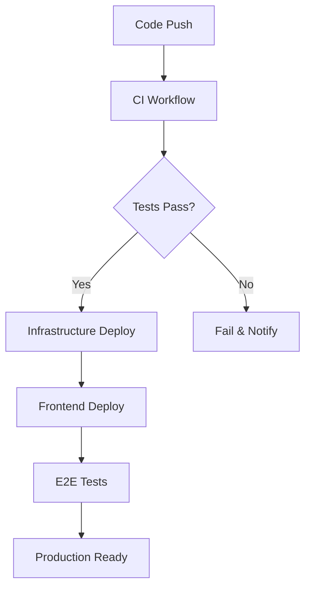

# Echoes DevOps and Deployment Guide

This document provides comprehensive information about the DevOps pipeline and deployment processes for the Echoes application.

## 📋 Table of Contents

- [Architecture Overview](#architecture-overview)
- [Environment Management](#environment-management)
- [Local Development](#local-development)
- [CI/CD Pipeline](#cicd-pipeline)
- [Deployment Process](#deployment-process)
- [Monitoring and Logging](#monitoring-and-logging)
- [Troubleshooting](#troubleshooting)

## 🏗️ Architecture Overview

The Echoes application uses a serverless architecture on AWS with the following components:

### Infrastructure
- **API Gateway**: REST API endpoints
- **Lambda Functions**: Serverless compute for business logic
- **DynamoDB**: NoSQL database for metadata storage
- **S3**: Object storage for audio files and static assets
- **Cognito**: User authentication and authorization
- **CloudFront**: CDN for global content delivery
- **SNS/SQS**: Messaging and notifications
- **EventBridge**: Event-driven workflows

### Frontend
- **React Web App**: Deployed to S3 + CloudFront
- **React Native Mobile**: Deployed to app stores (production)

## 🌍 Environment Management

### Available Environments

| Environment | Purpose | Auto-Deploy | Manual Deploy |
|-------------|---------|-------------|---------------|
| `dev` | Development and testing | ✅ (main branch) | ✅ |
| `staging` | Pre-production validation | ✅ (release branches) | ✅ |
| `prod` | Production | ❌ | ✅ (manual approval) |

### Environment Configuration

Each environment has its own configuration files in the `environments/` directory:

```
environments/
├── dev/
│   ├── .env.frontend
│   ├── .env.backend
│   └── .env.infrastructure
├── staging/
│   ├── .env.frontend
│   ├── .env.backend
│   └── .env.infrastructure
└── prod/
    ├── .env.frontend
    ├── .env.backend
    └── .env.infrastructure
```

## 🔧 Local Development

### Prerequisites

- Node.js 18+
- Docker and Docker Compose
- AWS CLI
- SAM CLI
- Python 3.11+

### Quick Start

1. **Start local services:**
   ```bash
   ./scripts/local-dev/start-local.sh
   ```

2. **Test the environment:**
   ```bash
   ./scripts/local-dev/test-local.sh
   ```

3. **Start frontend development:**
   ```bash
   npm run dev
   ```

### Local Services

| Service | URL | Purpose |
|---------|-----|---------|
| Frontend | http://localhost:3000 | React development server |
| Backend API | http://localhost:8000 | FastAPI development server |
| SAM Local API | http://localhost:3001 | Lambda functions locally |
| LocalStack | http://localhost:4566 | AWS services simulation |
| DynamoDB Admin | http://localhost:8001 | Database management UI |
| MailHog | http://localhost:8025 | Email testing |
| PostgreSQL | localhost:5432 | Local database |
| Redis | localhost:6379 | Caching |

### Development Commands

```bash
# Start all local services
./scripts/local-dev/start-local.sh

# Start with SAM Local API
./scripts/local-dev/start-local.sh --sam-local

# Stop all services
./scripts/local-dev/stop-local.sh

# Clean restart
./scripts/local-dev/stop-local.sh --clean-all
./scripts/local-dev/start-local.sh

# Test environment
./scripts/local-dev/test-local.sh
```

## 🚀 CI/CD Pipeline

### GitHub Actions Workflows

#### 1. Continuous Integration (`ci.yml`)
- **Triggers**: Push to main/develop, pull requests
- **Jobs**:
  - Code linting and formatting
  - Unit and integration tests
  - Security scanning
  - Build validation

#### 2. Infrastructure Deployment (`deploy-infrastructure.yml`)
- **Triggers**: Push to main (infrastructure changes), manual dispatch
- **Jobs**:
  - CDK synthesis and validation
  - Sequential stack deployment (storage → auth → api → notifications)
  - Smoke tests
  - Deployment notifications

#### 3. Frontend Deployment (`deploy-frontend.yml`)
- **Triggers**: Push to main (frontend changes), manual dispatch
- **Jobs**:
  - Build optimization
  - S3 deployment
  - CloudFront invalidation
  - E2E testing
  - Performance auditing

### Pipeline Flow



## 📦 Deployment Process

### Manual Deployment

#### Infrastructure Deployment
```bash
# Deploy to dev
./scripts/deployment/deploy-infrastructure.sh -e dev

# Deploy specific stacks to staging
./scripts/deployment/deploy-infrastructure.sh -e staging -s storage,auth

# Production deployment with confirmation
./scripts/deployment/deploy-infrastructure.sh -e prod
```

#### Frontend Deployment
```bash
# Deploy web to dev
./scripts/deployment/deploy-frontend.sh -e dev -p web

# Deploy mobile to production
./scripts/deployment/deploy-frontend.sh -e prod -p mobile

# Build only (no deployment)
./scripts/deployment/deploy-frontend.sh -e staging -b
```

### Deployment Order

Infrastructure stacks must be deployed in order:

1. **Storage Stack**: S3 buckets, DynamoDB tables
2. **Auth Stack**: Cognito User Pool and Identity Pool
3. **API Stack**: Lambda functions, API Gateway
4. **Notifications Stack**: SNS topics, SQS queues, EventBridge

### Rollback Process

```bash
# Rollback infrastructure
./scripts/deployment/deploy-infrastructure.sh -e staging -d

# Rollback to previous frontend version
aws s3 sync s3://echoes-backups-staging/frontend/previous/ s3://echoes-web-staging/
```

## 📊 Monitoring and Logging

### CloudWatch Dashboards

- **Application Metrics**: Request counts, latencies, error rates
- **Infrastructure Metrics**: Lambda duration, DynamoDB capacity, S3 usage
- **Custom Metrics**: User actions, business KPIs

### Alerts and Notifications

Alerts are configured for:
- High API latency (>5 seconds)
- Error rates above threshold
- Lambda function failures
- DynamoDB throttling
- CloudFront errors
- Storage usage limits

### Log Aggregation

Logs are centralized in CloudWatch:
- `/aws/lambda/echoes-{env}-{function}`: Lambda function logs
- `/aws/apigateway/echoes-{env}`: API Gateway access logs
- `/aws/cloudfront/echoes-{env}`: CloudFront distribution logs

### Accessing Logs

```bash
# View Lambda logs
aws logs tail /aws/lambda/echoes-dev-save-echo --follow

# View API Gateway logs
aws logs tail /aws/apigateway/echoes-dev --follow

# Query logs with insights
aws logs start-query \
  --log-group-name "/aws/lambda/echoes-dev-save-echo" \
  --start-time 1625097600 \
  --end-time 1625184000 \
  --query-string "fields @timestamp, @message | filter @message like /ERROR/"
```

## 🛠️ Troubleshooting

### Common Issues

#### 1. LocalStack Not Starting
```bash
# Check Docker
docker ps
docker-compose -f docker-compose.local.yml logs localstack

# Restart LocalStack
docker-compose -f docker-compose.local.yml restart localstack
```

#### 2. CDK Deployment Failures
```bash
# Check CDK bootstrap
cdk bootstrap

# Validate templates
cd cdk && cdk synth

# Check CloudFormation events
aws cloudformation describe-stack-events --stack-name EchoesStorageStack-dev
```

#### 3. Frontend Build Issues
```bash
# Clear cache
rm -rf node_modules package-lock.json
npm install

# Check environment variables
cat environments/dev/.env.frontend
```

#### 4. Lambda Function Errors
```bash
# Check function logs
aws logs tail /aws/lambda/echoes-dev-save-echo --follow

# Test function locally
sam local invoke SaveEchoFunction --event test-events/save-echo.json
```

### Health Check Endpoints

- **API Health**: `GET /health`
- **LocalStack Health**: `GET http://localhost:4566/_localstack/health`
- **Database Health**: Check via DynamoDB Admin UI

### Support Resources

- **AWS Documentation**: https://docs.aws.amazon.com/
- **CDK Documentation**: https://docs.aws.amazon.com/cdk/
- **LocalStack Documentation**: https://docs.localstack.cloud/
- **GitHub Actions Documentation**: https://docs.github.com/en/actions

## 🔒 Security Considerations

### Secrets Management

- Environment variables stored in GitHub Secrets
- AWS credentials configured per environment
- Database passwords auto-generated and stored in Secrets Manager
- API keys rotated regularly

### Access Control

- IAM roles with least privilege principle
- Cognito for user authentication
- API Gateway with JWT validation
- S3 bucket policies for secure file access

### Compliance

- GDPR compliance for user data
- Data encryption at rest and in transit
- Audit logging enabled
- Regular security scans in CI/CD

## 📈 Performance Optimization

### Frontend Optimization

- Code splitting and lazy loading
- Image optimization and CDN caching
- Service worker for offline functionality
- Bundle size analysis and optimization

### Backend Optimization

- Lambda function warm-up strategies
- DynamoDB auto-scaling
- API Gateway caching
- CloudFront edge caching

### Monitoring Performance

- Core Web Vitals tracking
- API response time monitoring
- Database query performance
- Cost optimization alerts

---

For more detailed information, see the individual documentation files in the `docs/` directory.